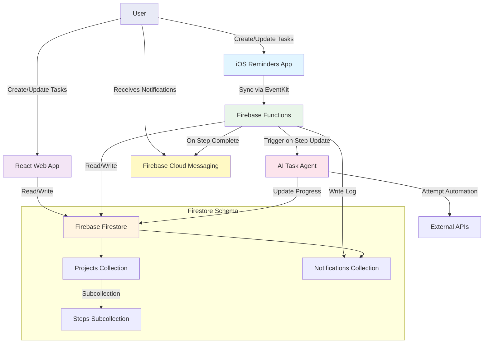

# Project Context for Claude

## Project Overview

An intelligent project management system that:

- Allows easy task creation and updates via iOS Reminders or React web interface
- Tracks detailed progress for each step in a project
- Uses AI/automation to complete tasks when possible
- Sends push notifications on step completion with details about next steps
- Falls back to manual updates when automation isn't possible

## Tech Stack

**Backend:**

- Firebase Firestore (database)
- Firebase Functions (event-driven automation)
- Firebase Cloud Messaging (push notifications)

**Frontend:**

- React Web App
- iOS Reminders (via EventKit integration)

**AI/Automation:**

- AI Agent for task execution
- Integration APIs for automated task completion

## Project Structure

## Development Guidelines

<!-- Add any coding standards, conventions, or best practices -->

## Key Information

<!-- Add any important context, gotchas, or things to remember -->

## Current Focus

<!-- What are you currently working on? -->

## Notes

<!-- Any additional notes or reminders -->
